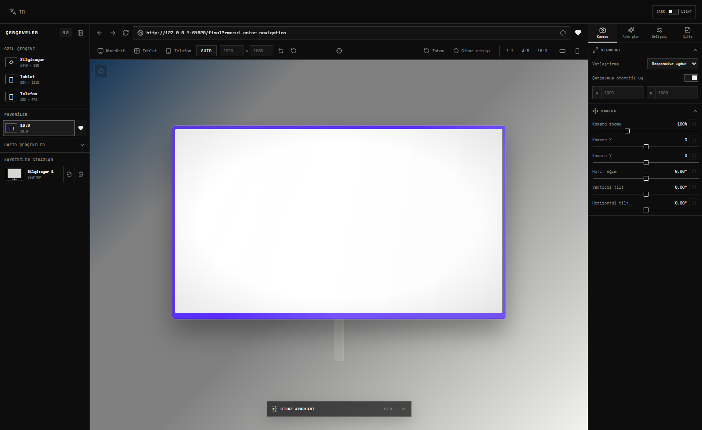

# Responsive Mockup Studio

[English](README.md) · [Türkçe](README.tr.md)

Responsive Mockup Studio is a YCSWU Tools creative application for placing real responsive websites inside configurable technical device mockups. It ships as a static web application, a Windows installer and a portable Windows executable.



## What it does

- Opens a URL inside the selected mockup screen when Enter is pressed.
- Uses a real embedded Chromium webview in the Windows build, including live navigation and persistent browser sessions.
- Switches between automatic responsive sizing and an explicit custom CSS viewport.
- Provides custom desktop, tablet and phone frames plus locked ready-made aspect-ratio presets.
- Keeps website content synchronized with the physical screen area when frame geometry changes.
- Exports the composition visible in the preview rather than tiling or duplicating the captured page.

## Device and frame system

- Compact custom-frame choices for computer, tablet and phone.
- Ready frames for 16:9, 16:10, 21:9 ultrawide, 32:9 super-ultrawide, dual-resolution desktop, laptop, tablet and phone proportions.
- Manufacturer names are deliberately omitted; ready frames are identified by geometry and aspect ratio.
- Ready-frame dimensions stay technically locked while supported appearance properties remain editable.
- Frame color input with a native picker and direct HEX entry.
- Material presets with roughness and reflectivity controls.
- Adjustable outer frame thickness and physical corner radii on custom devices.
- Independent screen width and height controls on custom frames.
- Matte-screen and glass-reflection controls.
- Adjustable part gradient angle, size and softness.
- Wireframe mode for the physical device only; the website screen remains visible.
- Adjustable wireframe color and outward contour thickness so the outline does not cover the glass.
- Supported removable parts: monitor stem, base, device detail, laptop front lip and phone side controls.
- Hover removal with confirmation, plus immediate restore controls in the viewport toolbar.
- Saved custom devices with thumbnails, persistent local storage and direct empty-device PNG export.
- Persistent ready-frame favorites.

## Responsive preview and composition

- Desktop, tablet and phone breakpoint shortcuts automatically select the matching custom frame family.
- Automatic viewport mode tracks the actual device screen and responsive breakpoints without letterboxing.
- Manual width/height mode with swap and reset controls.
- Middle-mouse drag updates Camera X/Y; mouse wheel updates Camera Zoom.
- Camera zoom, X/Y, Z rotation, vertical tilt and horizontal tilt.
- Per-slider reset controls and double-click-to-reset behavior.
- A standalone center control returns the device to the exact geometric center.
- Optional 1:1, 4:5 and 16:9 composition frames.
- Landscape and portrait orientation controls.
- Clicking an active ratio again exits framing and returns to the full preview composition.
- Frame-exterior masking affects only the preview canvas; application controls stay interactive above it.
- Draggable four-column Device Settings drawer, including its collapsed handle.
- Collapsible left Frames panel; the preview expands into the released area while keeping the device centered.

## Browser workflow

- Editable address bar with URL normalization and Enter navigation.
- Persistent recent URL history.
- Persistent bookmarks from either the address-bar heart or the Recent URLs list.
- Back/forward/reload behavior supplied by the live Chromium view where available.
- Optional scrollbar and pointer hiding applied to both preview and export.
- Optional animation freeze and page-background removal.
- Custom CSS injection.
- Automatic discovery of useful page elements such as headers, navigation, footers, dialogs and fixed elements.
- Eye controls hide or restore discovered CSS elements without allowing dangerous root selectors to blank the entire page.

## Backgrounds and appearance

- Black, white, transparent, custom-color, image and multi-stop gradient backgrounds.
- Linear or radial gradients.
- Unlimited gradient color stops with direct HEX input and adjustable positions.
- Dark and light application themes.
- Turkish and English interface languages.
- Local Space Mono font files—no font CDN is required.
- Sharp monochrome YCSWU UI: all application panels, buttons, fields, switches and menus use zero-radius corners.
- High-opacity, strongly blurred Device Settings glass panel with high-contrast labels.

## Export

- PNG, transparent PNG, JPG, WebP and SVG.
- Adjustable long edge, DPI and JPEG/WebP quality.
- Exports the entire active preview composition or the selected framing crop.
- High-density single-viewport Chromium capture; no 2×2 page tiling.
- Transparent output with genuinely transparent outer pixels.
- Native vector device geometry and CSS shapes in SVG output.
- Website text converted to font-independent vector paths, so the SVG does not substitute fonts on another computer.
- No `foreignObject` wrapper in SVG output.
- Existing vector page assets remain inline vectors when possible; photographs remain bitmap assets.
- Export engines are loaded only when needed. Raster encoding uses asynchronous `toBlob` and avoids redundant full-size canvas copies.

## Web and Windows differences

The Windows edition uses Electron's embedded Chromium webview and can navigate and capture normal external websites while preserving site sessions. The static web edition obeys browser iframe and cross-origin policies. A remote site that forbids embedding may not appear in the web build; unrestricted external-site capture is therefore a Windows feature.

All frame editing, camera, composition, background and local persistence features are shared by both editions.

## Privacy and storage

- Bookmarks, recent URLs, favorites, saved devices and editor settings stay in the local browser/application profile.
- The static web build needs no database or server-side runtime.
- The obsolete proprietary project-file open/save system is not included.

## Development

Requirements: Node.js 20 or newer, npm and Windows for Windows packaging.

```powershell
npm.cmd install
npm.cmd run dev
```

Build and verify the web application:

```powershell
npm.cmd run qa
```

Build web, source, Setup and Portable releases:

```powershell
npm.cmd run release:all
```

Important scripts:

- `npm.cmd run typecheck` — TypeScript validation.
- `npm.cmd run test:unit` — source and regression tests.
- `npm.cmd run build:web` — production static web build.
- `npm.cmd run dist:win` — Windows Setup and Portable builds.
- `npm.cmd run release:all` — complete release and SHA-256 manifests.

## cPanel deployment

The deployable archive is `Responsive-Mockup-Studio-Web-cPanel-1.2.5.zip`. It is built for:

```text
https://ycswu.co/mockup-studio/
```

Create `public_html/mockup-studio`, upload the ZIP into that directory, extract it there and confirm that `index.html` is directly inside `mockup-studio`—not inside another nested folder. The package contains relative application asset paths, `DirectoryIndex`, SPA fallback rules, cache/compression rules, `robots.txt`, `sitemap.xml`, SoftwareApplication JSON-LD, Open Graph metadata, a web manifest and `llms.txt`.

See [DEPLOY-CPANEL-TR.md](DEPLOY-CPANEL-TR.md) for the exact Turkish upload checklist.

## Quality assurance

The v1.2.5 release was verified through:

- 32 unit/regression tests.
- Source, Portable and installed Setup Electron smoke tests.
- 58 runtime assertions with zero application errors.
- Three real-site captures and multiple responsive aspect ratios.
- 4000 px / 300 DPI raster export.
- Transparent, framed, material, wireframe and saved-empty-device exports.
- Native SVG and YCSWU website SVG validation with zero text nodes, zero `foreignObject` elements and font-independent text outlines.
- Real silent install, installed-app execution, uninstall and install-directory removal.
- Static web ZIP extraction and HTTP asset smoke testing.

## Project structure

```text
electron/     Electron main process, preload and SVG text outliner
public/       Web metadata, SEO files, icon and social preview
scripts/      Asset, vector-bundle and release packaging scripts
src/          React editor, geometry, Canvas and SVG composition engines
tests/        Unit, regression and build validation tests
metadata/     YCSWU Tools manifest
```

## License

MIT. See [LICENSE](LICENSE).

Created by Ali Guzel / YCSWU.
