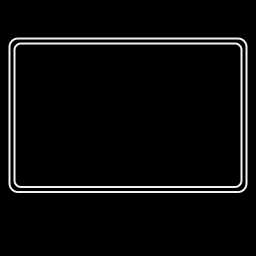

# Responsive Mockup Studio

<p align="center"></p>

[English](README.md) · [Türkçe](README.tr.md)

Responsive Mockup Studio, gerçek responsive web sitelerini ayarlanabilir teknik cihaz mockup'larının içine yerleştiren bir YCSWU Tools creative uygulamasıdır. Statik web uygulaması, Windows kurulum dosyası ve kurulumsuz Portable EXE olarak yayınlanır.


## Ne yapar?

- Adres çubuğuna yazılan URL'yi Enter'a basıldığında seçili cihaz ekranında açar.
- Windows sürümünde canlı gezinme ve kalıcı tarayıcı oturumlarıyla gerçek gömülü Chromium webview kullanır.
- Otomatik responsive ölçülendirme ile elle girilen özel CSS viewport ölçüsü arasında geçiş yapar.
- Özel bilgisayar, tablet ve telefon çerçevelerinin yanında teknik oranı kilitli hazır çerçeveler sunar.
- Çerçeve geometrisi değiştiğinde website içeriğini fiziksel ekran alanıyla eşzamanlı tutar.
- Yakalanan sayfayı çoğaltmadan veya döşemeden önizlemede görülen kompozisyonu dışa aktarır.

## Cihaz ve çerçeve sistemi

- Kompakt özel Bilgisayar, Tablet ve Telefon seçenekleri.
- 16:9, 16:10, 21:9 ultrawide, 32:9 super-ultrawide, çift çözünürlüklü masaüstü, laptop, tablet ve telefon oranları.
- Marka/model isimleri kullanılmaz; hazır çerçeveler geometri ve en-boy oranıyla tanımlanır.
- Hazır çerçevelerin teknik ölçüleri kilitli kalırken desteklenen görünüm özellikleri değiştirilebilir.
- Native renk seçici ve doğrudan HEX girişiyle cihaz rengi.
- Pürüzlülük ve yansıma kontrollü materyal seçenekleri.
- Özel cihazlarda ayarlanabilir dış çerçeve kalınlığı ve fiziksel köşe radiusları.
- Özel çerçevelerde bağımsız ekran eni ve boyu.
- Mat ekran ve cam yansıması kontrolleri.
- Ayarlanabilir parça gradient açısı, boyutu ve yumuşaklığı.
- Yalnızca fiziksel cihazı etkileyen wireframe modu; website ekranı görünür kalır.
- Camın üzerine taşmayan, dışa doğru büyüyen wireframe kontür kalınlığı ve renk seçimi.
- Desteklenen kaldırılabilir parçalar: monitör borusu, taban, cihaz detayı, laptop ön dudağı ve telefon yan tuşları.
- Üzerine gelince görünen X, onay penceresi ve viewport barında doğrudan geri getirme kontrolleri.
- Thumbnail'li, local olarak kalıcı kayıtlı özel cihazlar ve doğrudan boş-ekran PNG dışa aktarma.
- Kalıcı hazır çerçeve favorileri.

## Responsive önizleme ve kompozisyon

- Masaüstü, Tablet ve Telefon kısayolları ilgili özel çerçeve ailesini otomatik seçer.
- AUTO viewport, letterbox boşluğu bırakmadan gerçek cihaz ekranını ve responsive breakpoint'leri takip eder.
- En/boy yer değiştirme ve sıfırlama kontrollü manual ölçü modu.
- Orta mouse tuşuyla sürükleme Camera X/Y'yi; mouse tekerleği Camera Zoom'u değiştirir.
- Kamera zoom, X/Y, Z eğimi, vertical tilt ve horizontal tilt ayarları.
- Her slider için reset ikonu ve slider'a çift tıklayınca varsayılana dönme.
- Bağımsız Ortala tuşu cihazı tam geometrik merkeze döndürür.
- İsteğe bağlı 1:1, 4:5 ve 16:9 kompozisyon frame'leri.
- Yatay ve dikey yön seçimi.
- Etkin orana tekrar basınca frame seçiminden çıkıp tam önizlemeye dönme.
- Frame dışı maskeleme yalnız önizleme canvas'ını etkiler; UI kontrolleri üstte çalışmaya devam eder.
- Küçültülmüş tutamacı dahil sürüklenebilir dört kolonlu Cihaz Ayarları paneli.
- Kapatılabilir sol Çerçeveler paneli; cihaz boşalan önizleme alanının merkezinde kalır.

## Tarayıcı akışı

- URL normalizasyonu ve Enter ile çalışan adres çubuğu.
- Kalıcı Recent URLs listesi.
- Adres çubuğundaki kalpten veya Recent URLs listesinden kalıcı bookmark yönetimi.
- Desteklenen ortamlarda gerçek Chromium geri/ileri/yenile davranışı.
- Önizleme ve exporta birlikte uygulanan scrollbar ve imleç gizleme.
- Animasyonları dondurma ve sayfa zeminini gizleme.
- Özel CSS uygulama.
- Header, navigation, footer, dialog ve fixed elemanlar gibi kullanışlı sayfa öğelerini otomatik bulma.
- Tehlikeli kök seçicilerin tüm siteyi silmesini engelleyen güvenli gözle gizle/geri getir sistemi.

## Arka plan ve görünüm

- Siyah, beyaz, şeffaf, özel renk, görsel ve çok duraklı gradient arka planlar.
- Linear veya radial gradient.
- Doğrudan HEX girişi ve pozisyon kontrollü sınırsız gradient rengi.
- Dark ve light uygulama teması.
- Türkçe ve İngilizce arayüz.
- Yerel paketlenen Space Mono; font CDN'i gerekmez.
- Keskin siyah-beyaz YCSWU UI: bütün panel, buton, alan, switch ve menü köşeleri `0px` radius kullanır.
- Yüksek opaklık, güçlü blur ve yüksek yazı kontrastlı mat glass Cihaz Ayarları paneli.

## Dışa aktarma

- PNG, şeffaf PNG, JPG, WebP ve SVG.
- Ayarlanabilir uzun kenar, DPI ve JPEG/WebP kalitesi.
- Tam aktif önizleme kompozisyonu veya seçilen frame kırpımı.
- Tek viewport yüksek yoğunluklu Chromium capture; 2×2 sayfa döşemesi oluşmaz.
- Dış köşeleri gerçekten şeffaf PNG.
- SVG'de gerçek vektörel cihaz geometrisi ve CSS şekilleri.
- Website metnini fonttan bağımsız vektör path'lerine çevirme; SVG başka bilgisayarda font değiştirmez.
- SVG içinde `foreignObject` kullanılmaz.
- Uygun website SVG varlıkları inline vektör kalır; fotoğraflar bitmap olarak korunur.
- Export motorları yalnız gerektiğinde yüklenir. Raster kodlama asenkron `toBlob` kullanır ve gereksiz tam boy canvas kopyası üretmez.

## Web ve Windows farkı

Windows sürümü Electron'un gömülü Chromium webview'ını kullanır; normal harici sitelerde gezinip mevcut site oturumunu koruyarak capture alabilir. Statik web sürümü tarayıcının iframe ve cross-origin kurallarına uyar. Gömülmeyi reddeden uzak siteler web sürümünde görüntülenmeyebilir; sınırsız harici website capture bu nedenle Windows sürümünün özelliğidir.

Çerçeve düzenleme, kamera, kompozisyon, arka plan ve local kayıt özellikleri iki sürümde de ortaktır.

## Gizlilik ve kayıt

- Bookmark, Recent URL, favori, kayıtlı cihaz ve editör ayarları kullanıcının yerel tarayıcı/uygulama profilinde saklanır.
- Statik web paketi veritabanı veya server-side runtime gerektirmez.
- Eski özel proje dosyası aç/kaydet sistemi bulunmaz.

## Geliştirme

Gereksinimler: Node.js 20+, npm ve Windows paketlemesi için Windows.

```powershell
npm.cmd install
npm.cmd run dev
```

Web uygulamasını doğrula ve derle:

```powershell
npm.cmd run qa
```

Web, kaynak, Setup ve Portable paketlerini üret:

```powershell
npm.cmd run release:all
```

Önemli komutlar:

- `npm.cmd run typecheck` — TypeScript doğrulaması.
- `npm.cmd run test:unit` — kaynak ve regresyon testleri.
- `npm.cmd run build:web` — production statik web derlemesi.
- `npm.cmd run dist:win` — Windows Setup ve Portable derlemesi.
- `npm.cmd run release:all` — eksiksiz release ve SHA-256 manifestleri.

## cPanel kurulumu

Hazır arşiv: `Responsive-Mockup-Studio-Web-cPanel-1.2.6.zip`

Hedef URL:

```text
https://ycswu.co/mockup-studio/
```

`public_html/mockup-studio` klasörünü oluştur, ZIP'i bu klasöre yükle ve burada çıkart. `index.html` doğrudan `mockup-studio` klasörünün içinde olmalı; arada ikinci bir paket klasörü bulunmamalı. Paket göreli uygulama asset yolları, `DirectoryIndex`, SPA fallback, cache/sıkıştırma kuralları, `robots.txt`, `sitemap.xml`, SoftwareApplication JSON-LD, Open Graph verileri, web manifest ve `llms.txt` içerir.

Adım adım kontrol için [DEPLOY-CPANEL-TR.md](DEPLOY-CPANEL-TR.md) dosyasına bak.

## Kalite doğrulaması

v1.2.6 release'i şu kontrollerden geçti:

- 32 unit/regresyon testi.
- Kaynak, Portable ve kurulu Setup Electron smoke testleri.
- Sıfır uygulama hatasıyla 58 runtime assertion.
- Üç gerçek site ve birden fazla responsive oran capture'ı.
- 4000 px / 300 DPI raster export.
- Şeffaf, frame'li, materyalli, wireframe ve boş kayıtlı cihaz exportları.
- Sıfır text node, sıfır `foreignObject` ve fonttan bağımsız outline ile native SVG/YCSWU SVG doğrulaması.
- Gerçek sessiz kurulum, kurulu uygulamayı çalıştırma, uninstall ve kurulum dizininin silinmesi.
- Web ZIP'ini açıp HTTP üzerinden index ve asset smoke testi.

## Proje yapısı

```text
electron/     Electron main process, preload ve SVG metin outline motoru
public/       Web metadata, SEO dosyaları, ikon ve sosyal paylaşım görseli
scripts/      Asset, vector bundle ve release paketleme scriptleri
src/          React editör, geometri, Canvas ve SVG kompozisyon motorları
tests/        Unit, regresyon ve build doğrulama testleri
metadata/     YCSWU Tools manifesti
```

## Lisans

MIT. [LICENSE](LICENSE) dosyasına bak.

Ali Guzel / YCSWU tarafından geliştirildi.
